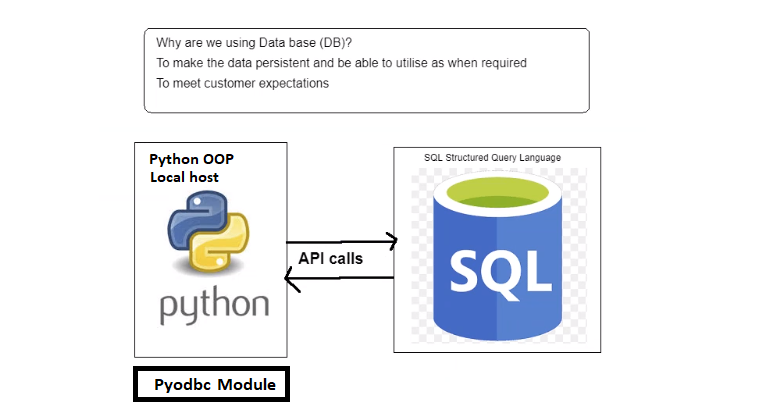

# Python SQL

## Pyodbc (Python Open Database Connectivity)
- Allows us to connect to SQL from python program
### Setting up pyodbc
- Set up a pyodbc connection
### Cursor in Python and how to use it

### Functions to interact with SQL data

